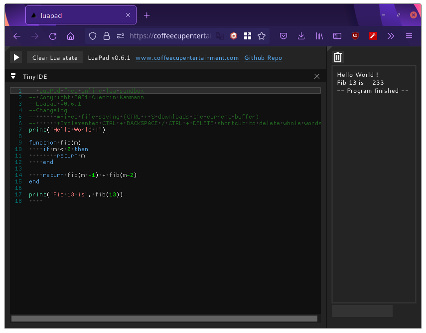

<br/>
<p align="center">
  <a href="https://github.com/xhighway999/LuaPad">
    
  </a>
  </p>
  <h3 align="center">LuaPad</h3>
  
  <p align="center">
  <a href="https://coffeecupentertainment.com/static/luapad/luapad.html">An awesome online Lua sandbox</a>
  </p>
  
  <p align="center">
    <a href="https://github.com/xhighway999/LuaPad/issues">Report Bug</a>
    <a href="https://github.com/xhighway999/LuaPad/issues">Request Feature</a>
</p>

   

## Table Of Contents

* [About the Project](#about-the-project)
* [Built With](#built-with)
* [Getting Started](#getting-started)
  * [Installation](#installation)

## About The Project



There are many online lua compiles online. But most of them use an outdated version of lua, are slow or are full of bugs.

So I created this online lua compiler:
It runs on WASM, so you can run lua scripts instantly.
No account required. Everything can be done without login.
The source code is available, in case I abandon this project.
It works on all mayor web browsers (expect for the clipboard in Firefox)

How to use it?

Go to https://coffeecupentertainment.com/static/luapad/luapad.html and just start coding.
Press the play button to run your code.

The Lua state is preserved between runs. This allows you to use the console to interact with the state.
You can download the code by pressing CTRL + S

Most common editor shortcuts work. If something you want is missing just open an issue on github.


## Built With

This project could  not have been made possible without the generosity of countless people who have provided me with the help I needed. Here are some of the most important projects that helped me:

* [xhfr](https://github.com/xhighway999/xhfr)
* [lua](https://github.com/lua/lua)
* [sol2](https://github.com/ThePhD/sol2)
* [emscripten](https://emscripten.org/)
* [dear Imgui](https://github.com/ocornut/imgui)

## Getting Started

This is an example of how you may give instructions on setting up your project locally.
To get a local copy up and running follow these simple example steps.


### Installation

Instructions for a web build:
1. Clone the repo recursively

```sh
git clone --recurse-submodules https://github.com/xhighway999/luapad
```

```sh
cd luapad
```


2. download and update emscripten
```sh
git clone https://github.com/emscripten-core/emsdk.git
source ./setupems.sh
```

3. create a new build directory and run cmake 
```sh
cd ../ && mkdir build *&& emcmake cmake ../
```

4. Compile !

```sh
make -j 12
```
